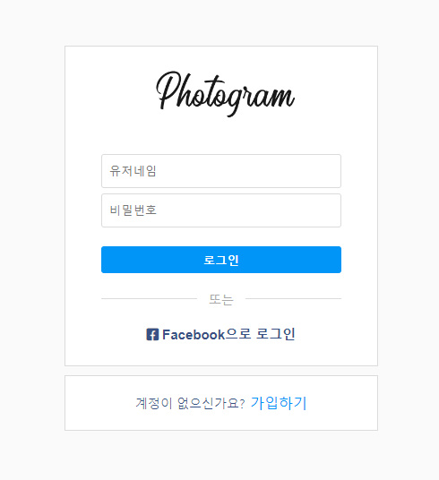
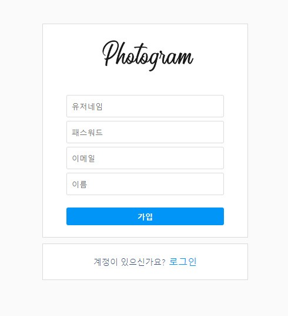
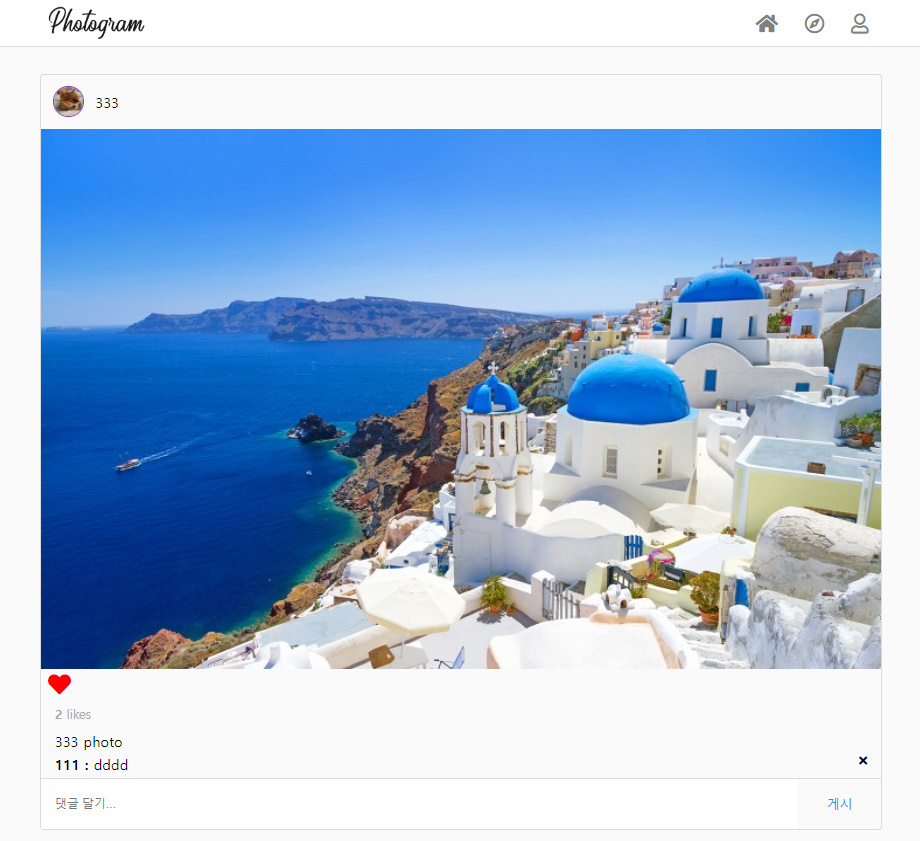
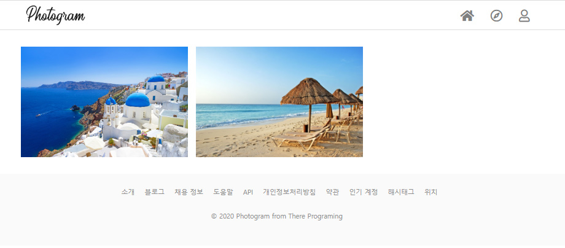
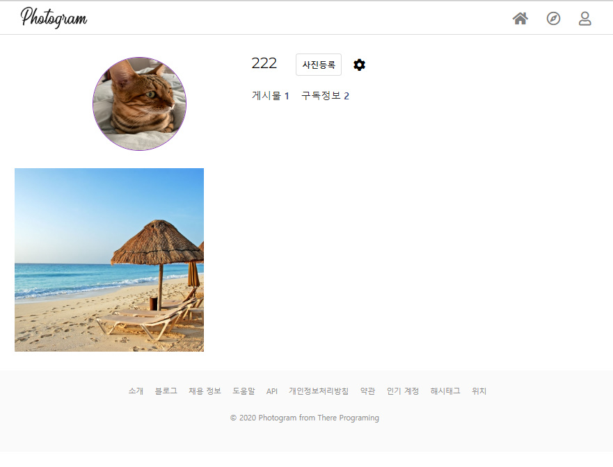
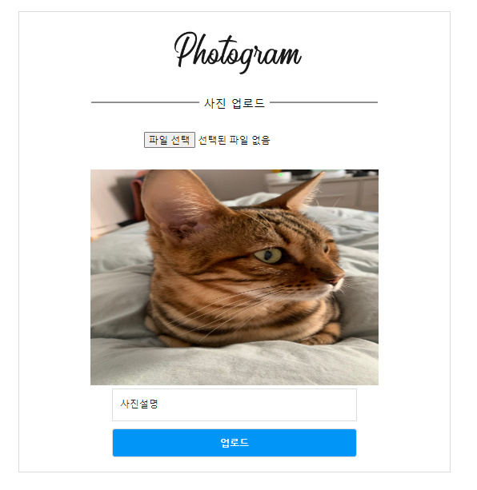

    <h2>Photogram</h2>
    
간단한 인스타그램 클론 코딩 프로젝트

## :pushpin: 프로젝트 소개

  ### **개요**

   인스타그램 형태로 만든 간단한 토이 프로젝트

 ### **세부사항**
  - 개발기간 : 2020.11.23~2020.12.04
  - 구현사항 : Spring Security, 로그인/회원가입, 좋아요, 댓글, 구독, 프로필 업로드, 게시글 작성, 
  - 개발 언어 : JAVA / 개발 툴: Spring Boot / RDBMS : MySQL
   

## 🔎**서비스 기능 소개**
- 로그인 및 회원가입
 | 
- 메인화면 / 인기 게시글
 | 
- 마이페이지 / 게시글 업로드
 | 

